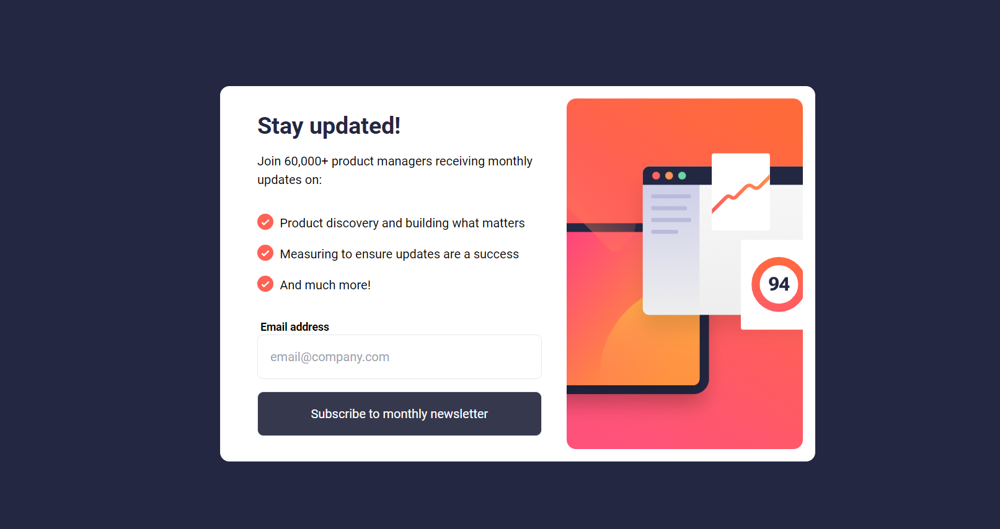

# Frontend Mentor - Newsletter sign-up form with success message solution

This is a solution to the [Newsletter sign-up form with success message challenge on Frontend Mentor](https://www.frontendmentor.io/challenges/newsletter-signup-form-with-success-message-3FC1AZbNrv). Frontend Mentor challenges help you improve your coding skills by building realistic projects. 

## Table of contents

- [Overview](#overview)
  - [The challenge](#the-challenge)
  - [Screenshot](#screenshot)
  - [Links](#links)
- [My process](#my-process)
  - [Built with](#built-with)
  - [What I learned](#what-i-learned)
  - [Continued development](#continued-development)
  - [Useful resources](#useful-resources)
- [Author](#author)
- [Acknowledgments](#acknowledgments)


## Overview

### The challenge

Users should be able to:

- Add their email and submit the form
- See a success message with their email after successfully submitting the form
- See form validation messages if:
  - The field is left empty
  - The email address is not formatted correctly
- View the optimal layout for the interface depending on their device's screen size
- See hover and focus states for all interactive elements on the page

### Screenshot




### Links

- Solution URL: [https://github.com/Boyutife/Newsletter-sign-up-form-with-success-message]
- Live Site URL: [https://boyutife.github.io/Newsletter-sign-up-form-with-success-message/]

## My process

### Built with

- Semantic HTML5 markup
- CSS custom properties
- Flexbox
- CSS Grid
- Mobile-first workflow
-TailwindCss
-Chatgpt
-Scrimba Turtorial


### What I learned

I learnt about local storage which i evetually didnt use 
instead i opt for the 
```js
window.location.href=`success.html?email${encodeURIComponent(email)}`
```
am yet to get a hang of it , I needed it to be able to use the email i obtain from one js file in another , which worked ,same purposei needed the local storage for.

then to retrive it on the needed js
```js
  let queryString = window.location.search
  let urlParams = new URLSearchParams(queryString)
  let email = urlParams.get("email")

```

Javascript is really challenging and fun 🥳 ..... though stressful and frustrating 😣😪
I will keep practising till i get a firm hold of it

If you want more help with writing markdown, we'd recommend checking out [The Markdown Guide](https://www.markdownguide.org/) to learn more.


### Continued development

As a web developer, it's essential to take the time to master JavaScript before diving into frameworks. Rushing through the language may lead to a shallow understanding and difficulties down the road. By focusing on JavaScript fundamentals, problem-solving skills, and navigating the JavaScript ecosystem, you'll build a strong foundation for your career and set yourself up for success in both JavaScript and any frameworks you choose to learn. Remember, patience and a deep understanding of JavaScript will ultimately accelerate your growth as a developer.

### Useful resources

- [ChatGPT](https://chat.openai.com/) - This helped me for logical reason. I really liked this pattern and will use it going forward.


## Author

- Website - [Boluwatife Aiyenibe](https://github.com/Boyutife/Newsletter-sign-up-form-with-success-message)
- Frontend Mentor - [@Boyutife](https://www.frontendmentor.io/profile/boyutife)
- Twitter - [@boluwatife_ven](https://www.twitter.com/boluwatife_ven)


## Acknowledgments

I appreciate God for the gift of life, wisdom and understanding. I thank Ujah Emmanuel 
